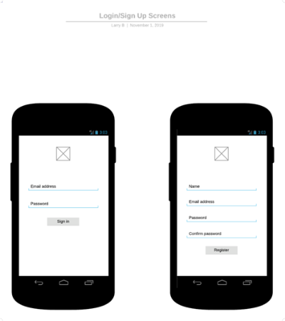
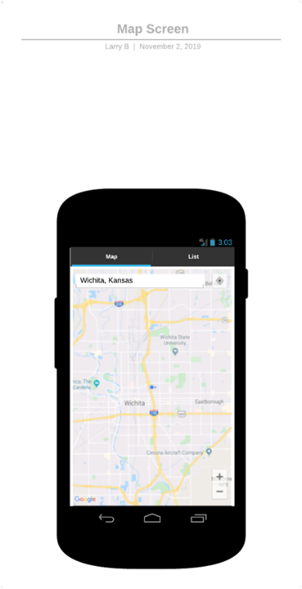
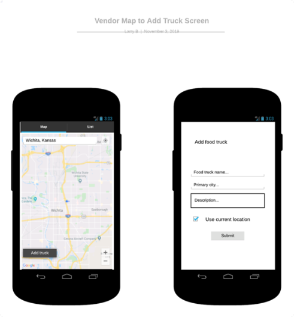
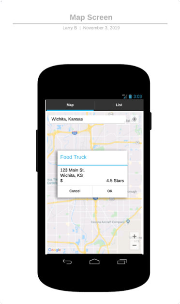
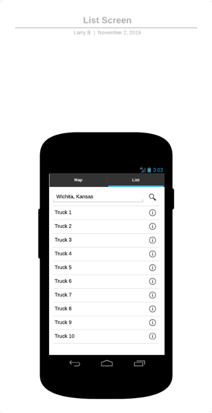

# Tacomotive

## Overview

Tacomotive is a mobile application designed to help food truck (especially taco truck) lovers find
their favorite vendors. At its core, Tacomotive will use real-time location data to dynamically
display the location of food trucks near the user’s location.

One major challenge mobile vendors face is communicating with their customers about their current
location. Furthermore, despite social platforms like Facebook and Twitter, it can still be
difficult to locate a specific vendor. If I want to find the location of one of my favorite taco
trucks, I have to figure out which platform they MAY be using to communicate with customers (i.e. Facebook, Twitter, Yelp, etc.),
find their listing on the platform, and hope they have a post detailing their current location at
that specific day or time. This problem is exasperated if I want to find the location of more than
one truck, as I must repeat this process for each truck I am interested in. Tacomotive aims to
solve this problem by providing a platform tailored to the food truck business, making it easy for
vendors to update their locations, and for users to easily find these locations on a map.

Let’s consider a couple of common scenarios in which Tacomotive would be helpful to both a consumer
and a vendor. First, as the purveyor of a food truck in my town, I want to communicate quickly and
efficiently with my customers about my location for the day. I would simply open the Tacomotive app,
sign in to my account, which would ask me if I want to share my location. After clicking yes, the
app would update its database with the coordinates of my location which would be pushed out to
anyone using the app. I would then see a map with my location, very similar to what users of the
application would see.

Second, as a lover of taco trucks, knowing they can sometimes be difficult to locate, I decide to
download the Tacomotive app and see what trucks are currently in my area.
After opening the app, I am prompted to share my location. Next, a map would be updated in real-time
showing the location of taco trucks within a default radius. Should I chose not to share my location,
I have the ability to enter any address into a search box and Tacomotive will search that area for
vendors.

Although I have already developed the web version of this application, the primary focus of this
project is to design the mobile version which will use the APIs available from the web app. As such,
the mobile application will be using account information for food truck owners, details about their
business, as well as user details. While I have not explicitly planned to allow users to place
orders through the mobile application, I would like to at least have some pricing or menu data
available for the businesses. Another feature I would like to include is the ability for owners
to schedule events and be booked for events in the future.

## Related Work
*(Please describe any similar applications that you have found through the online research, and the differences between your application and those applications.)*
### [Tacomotive](https://tacomotive.herokuapp.com)
This is a web version of the mobile application I have
proposed for my project. The site is built using MongoDB, Node.js, and
Express, with Handlebars templating. The Express server provides an API
which to create and authenticate user accounts, retrieve food truck
listings from Yelp, and a static menu. I plan to use these APIs to serve
data to the mobile application I will be building this course.

### [Street Food App](https://streetfoodapp.com)
While researching ideas for this project, I found Street Food App to be the closest to 
what I am looking to develop. Although I have not had a chance to 
download the mobile application, I have used the website to get some 
ideas about what I would like to implement. One thing I really 
appreciate about Street Food App is their easy to use and friendly 
interface. I also like that they have a map of food truck locations 
and that the food truck schedule is available.

### [Wichita Food Trucks](https://wichitafoodtrucks.com)
This website is a local website that provides information on food trucks
in the Wichita area. Food trucks join the site by becoming a member and
can list their menus and schedules. Visitors can see information about
the trucks, as well as book catering events. One thing I do not like about
this website is the fact that no map is provided, and most of the
location information is based on social media streams. 

## Proposed High level Requirements

### Essential Features: 
*(Please describe all essential features that your application will have. For each feature, please give a feature title, a brief description, possible acceptance tests, as well as one or multiple mock-up screen(s) if applicable.)* 
**1. Signup:** *As a user, I want to be able to sign up for an account.*

    Acceptance test: A user can create a new account using their name, email, and password with confirmation. The app cannot be used without an account.

**2. Login:** *As a user, I want to be able to login with my account to use the application*

    Acceptance test: The user can login using a previously created account.

**3. View a map of food trucks:** *As a user, I want to be able to see a map of food truck locations.*

    Acceptance test: The application displays a map with pins showing food truck locations in the specified area.

**4. Search for food trucks:** *As a user, I want to search for food trucks in a specified area.*

    Acceptance test: The app allows the user to enter a location on the map and search the area.

**5. Add a food truck:** *As a vendor, I want to be able to add a food truck to the application.*

    Acceptance test: Vendors can submit their food truck to the application.

**6. Update food truck location:** *As a vendor, I want to be able to update the location of my food truck.*

    Acceptance test: The application will update the food trucks location using GPS features of the phone.

**7. View food truck details:** *As a user, I would like to see details of the selected food truck, including exact location, hours of operation, rating, and average price.*

    Acceptance test: Selecting a food truck on the map displays a popup of details for the selected food truck.

### Desirable Features

*(Please describe all desirable features that your application would like to have. For each feature, please give a feature title, a brief description, possible acceptance tests, as well as one or multiple mock-up screen(s) if apply.)*

**1. View a list nearby food trucks:** *As a user, I would like to see a list of food trucks near my current location.*

    Acceptance test: The app displays an optional tab which displays a list of food trucks in the area.

**2. Add food truck to favorites:** *As a user, I would like to be able to favorite a food truck to easily find it later.*

    Acceptance test: Acceptance test: The user can tap an icon to add the food truck to their favorites list

### Optional Features

*(Please describe all optional features that your application would like to have if the time permits. For each feature, please give a feature title and a brief description.)*

1.	Schedule events: As a vendor, I would like the ability to schedule events at specific locations in the future.
2.	Book events: As a user, I would like to request a specific food truck to cater an event.
3.	View menus: As a user, I would like to see the menu for a selected food truck.

## Android Components and Features To Be Used

*(Please specify basic android components and features your application plans to have. Here is a list of components/features you can use: activities, databases and/or content providers, files, settings (through sharedpreferences), services, broadcast receivers, multi-threaded, multi-process, animation, graphics, remote server connection, GPS, microphone, camera, or other sensors, google APIs, etc. For each android component/feature, briefly describe how this can be fit into your application).*

•	Activities – login and sign up screen, map screen, food truck details
•	Databases/content providers – saved trucks
•	Settings – user preferences
•	Services (notifications)
•	GPS – tracking locations
•	Google APIs – maps and geolocating
•	Firebase – authentication and firestore

## Timeline

*(Please provide a detailed plan/description to specify when the above requirements and android features will be/are implemented. This should be updated in every iteration.)*

|Iteration | Application Requirements (E/D/O) | Android Components and Features| 
|---|---|---|
|1| 1. Signup (E), 2. Login (E) | Firestore, Activities, Database |
|2| 3. View map of food trucks (E), 4. Search for food trucks (E) | Firestore, Activities, Services, Google Maps API, GPS |
|3| 5. Add food truck (E), 6. Update food truck location | Firestore, Activities, Database, GPS |
|4| 7. View food truck details (E), 1. View list of food trucks (D) | Database, Firestore, Activities |
|5| 2. Add food truck to favorites (D) | Settings, Database, Firestore, Activities |

## Requirement Analysis and Testing 

*(In Iteration 1-5, for each requirement you have worked on in this iteration, please give a detailed description, completion status (completed, or partially completed) and show the testing results if completed or partially completed, such as screenshots of the application screens or log info.) Please also specify if this requirement is a new requirement or a requirement you had started in previous iterations. Please also specify what device do you use for testing )*

## Design and Implementation

*(In Iteration 1-5, please describe Android components and features you have used in this iteration to implement the above requirements in your application. For each feature you used, provide a brief description and supporting evidences, such as sample code, log info, or screenshot(s) of execution results. Please specify mapped requirements and files in your project.)*

## Project Structure
*(In Iteration 1-5, please provide a screenshot of your project structure, and describe what files are modified, added or deleted since the previous iteration.)*

## References

*(Please list all your references here)*

(n.d.). From Street Food App: https://www.streetfoodapp.com

(n.d.). From Wichita Food Trucks: https:/www.wichitafoodtrucks.com

Barker, L. (2019). Tacomotive. From Tacomotive: https://tacomotive.herokuapp.com

Barker, L. (2019). Tacomotive Database Project. 

Definition of 'Acceptance Testing'. (n.d.). Retrieved 11 1, 2019 from The Economic Times: https://economictimes.indiatimes.com/definition/acceptance-testing

What is User Acceptance Testing (UAT): A Complete Guide. (2019, August 21). Retrieved November 1, 2019 from Software Testing Help: https://www.softwaretestinghelp.com/what-is-user-acceptance-testing-uat/

